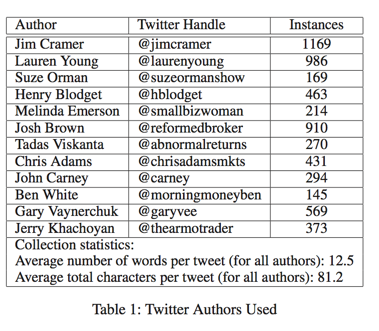
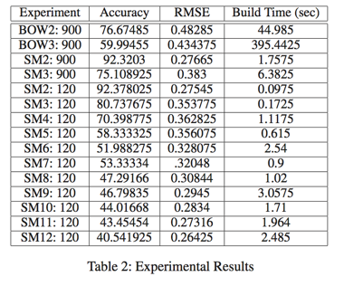

# Comparing Frequency and Style-Based Features from Twitter Author Identification
Published: Proceedings of the Twenty-Sixth International Florida Artificial Intelligence Research Society Conference
Author: Rachel M.Green, John W.Sheppard

Goal:
Examines author identification  in short texts using Both Bog-of_words (BOW) and Style Marker feature. Support Vector Machines (SVM) were used for all experiments.

Author identification in Twitter using supervised learning methods for data classification.

Hypothesis: Style Markers features set would perform better then the BOW feature set in terms of accuracy because BOW is not effective in small text.

Why SVM:
SVM is designed to handle high-dimensional data, and have applied successfully to author identification in previous Research

Experiment:
15 experiments designed to determine which type of feature set is most effective.

- Collect Data:
  Tweeter selection:
    - Frequent new messages (average 20+ tweets/day)
    - Primarily new material(no re-tweets or quotes from other sources)
    - Individual rather than corporate or group authorship
    - Relatively consistent style or voice preferred (However this is subjective and hard to control)
    - Same domain or subject matter focus across all authors

  Result of selection

  

  Clean:
  - Removed messages containing re-tweets
  - stop list

- Extract Features:
  Set 1:(BOW)
  Set 2:(Style Markers)86 features
    - count(characters, long words, whitespace, punctuation, hyperlinks, parts of speech)
    - overal message characteristics (total length, total words)
    - frequency values (characters per message by %, punctuation per message by %)

- Build models:
  - Use Sequential Minimal Optimization (SMO) algorith included in WEKA 2.6.8. A linear kernel with default parameters was used.
  - 5x2 cross validation design
- Evaluate Results:
  - 15 experiments
  - Each experiment was run multiple times with values such as root mean suared error (RMSE) recorded to verify statistical significance. Build time was also noted as a measure of efficiency.

  Results

  

Conclusion:
- Style Marker features sets were found to be significantly more useful than BOW features as well as orders of magnitude faster.
